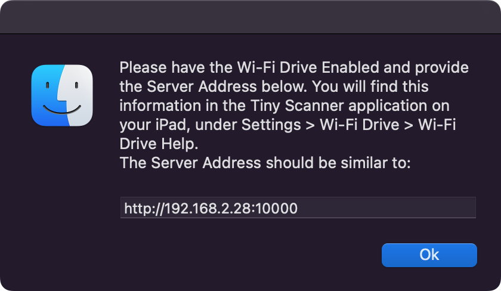
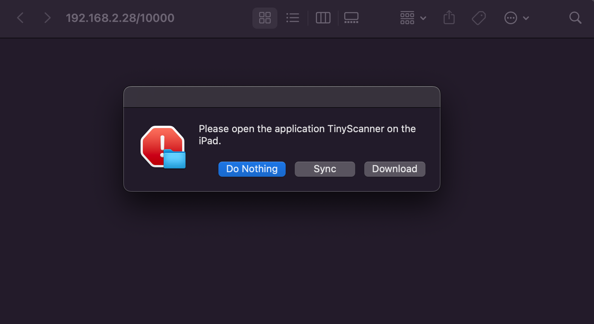

# TinyScanner-Connector
 Application designed to dump previously scanned pdf from an old iPad iOS 9.3.5 having the Tiny Scanner+ v4.1.1 application. Since I've previously paid for that application in the pass, before they've decided to release the same application but with a monthly payment, I've decided to recycle my old iPad to scan PDF during the Covid pandemic. I've been doing it using a bash script, but I've decided to give it a refresh and make and actual MacOS application.  
  
The app was design using Automator, some Applescript, and some Shell script.  
  
The icon was taken from the official TinyScanner application released in 2013 by Li Yunzhang.  
https://www.amazon.com/Tiny-Scanner-Pro-scanner-document/dp/B00FR88VTC  
  
The app works with the Tiny Scanner v4.1.1 (Tiny Scanner+ v4.1.1) using Wi-Fi Drive option enabled. It utilize the 'wget' command to download the content from the TinyScanner application on iPad iOS 9.3.5.  
  
The content is fetched from the provided server address, and dumped into the "TinyScanner.app/Contents/Dump" directory on your Mac.  
  
By opening the app, a Finder message box will open asking for the Server Address. This address can be found inside the iPad Tiny Scanner application, under 'Wi-Fi Drive' in the settings.  

  
    

  
  
After providing the Server Address, the Finder will open the directory  "TinyScanner.app/Contents/Dump/$ServerSocket", where the $ServerSocket is the IP Address and Port number from the server address previously provided. Then the user is prompt to either "Do Nothing", "Sync", or "Download".  

  
    

  
  
- Do Nothing: As the name implies, does nothing.  
- Sync: Will download missing files only. (If a file was modified but use the same name as the old one, deleting this particular file is necessary before using the "Sync" option).  
- Download: Will overwrite the whole directory with the content of the server (Redownload all files).  
  
  
If you have a lot of files that need to be transferred, it may take some times. As long as you see the following rotating gear in the menu bar, then files are being transfered from your iPad to your computer.  

  
  
# To download the app:
Downloading and unzipping the TinyScanner.zip file may results in a message saying "App is damaged and can’t be opened. You should move it to the Trash". A way around this, is to open the unzipped app using Automator and hit save. After, you can right-click on the app and click open. Make sure the iPad app is open.

